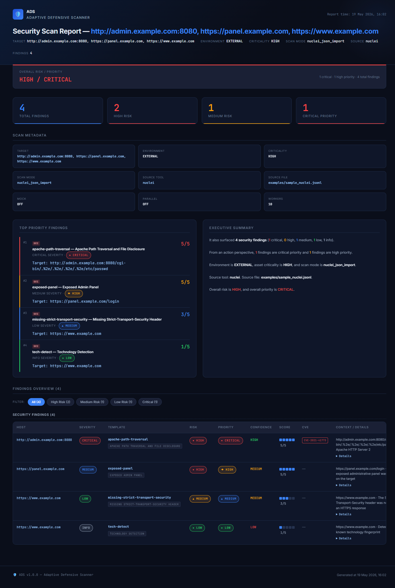

# Adaptive Defensive Scanner (ADS)

**Turn scanner output into defensive action.**

ADS is a single-binary, deterministic engine that normalizes Nmap, httpx / Osmedeus, and Nuclei output, scores risk and priority with context, and produces one unified HTML / JSON report. No SaaS, no database — runs locally on your laptop.

[](LICENSE)
[](https://www.python.org/)
[](https://github.com/YusufKaramuk1/adaptive-defensive-scanner/actions/workflows/tests.yml)

```text
Technical finding → Security meaning → Defensive action
```

---

## Quick Start

```powershell
pip install -e .
ads --import-nuclei-json examples\sample_nuclei.jsonl --environment external --criticality high
start reports\ads_report.html
```

That is the entire setup. You will get a dark-themed unified HTML report with
a "Security Findings" section, a severity-tagged "Top Priority Findings" panel,
and per-finding remediation guidance.

See [`examples/`](examples/) for ready-to-run sample inputs covering all three
import modes (Nmap XML, httpx / Osmedeus JSONL, Nuclei JSON / JSONL).



---

## Project Purpose

Most security tools are good at detecting technical facts:

```text
Port 445 is open.
Apache 2.4.49 is detected.
A web service returns HTTP 200.
A Nuclei template matched.
A subdomain exists.
```

ADS focuses on the next question:

```text
What does this mean defensively?
```

ADS tries to answer:

```text
Is this expected?
Is this exposed in the wrong environment?
Is there version or CVE evidence?
How confident is the finding?
How urgent is the action?
What should be fixed quickly?
What is the proper long-term fix?
What firewall rule could reduce exposure?
Did this exposure appear recently?
```

ADS therefore acts as a defensive interpretation layer.

---

## Core Concept

```text
Scan / Import
  ↓
Normalize Finding (ScanFinding or SecurityFinding)
  ↓
Service Classification
  ↓
CVE Enrichment
  ↓
Context-Aware Risk Analysis
  ↓
Confidence / Evidence
  ↓
Priority Engine
  ↓
Fix Recommendation
  ↓
Firewall Rule Suggestion
  ↓
Unified HTML / JSON Report
  ↓
History / Diff
```

Short version:

```text
Find → Understand → Prioritize → Fix → Report → Track Change
```

---

## What ADS Currently Does

ADS currently supports:

- Nmap-based live scanning
- Mock scanning for development and testing
- Subnet scanning
- Parallel subnet scanning
- Host-aware findings
- Nmap XML import
- httpx / Osmedeus JSONL import
- Nuclei JSON / JSONL import
- Service classification
- Context-aware risk scoring
- Local CVE enrichment
- Version-aware CVE matching
- Confidence scoring
- Evidence generation
- Priority calculation
- Quick-fix recommendation
- Proper-fix recommendation
- UFW firewall rule suggestion
- iptables firewall rule suggestion
- Unified HTML report (scan + security findings in one artifact)
- Unified JSON report (single schema for both pipelines)
- Scan history (last 20 runs)
- Scan diff (host-aware)
- Import source metadata tracking
- Web fingerprint metadata in reports
- Security finding pipeline for Nuclei-style vulnerability inputs

---

## What ADS Is Not

ADS is not:

- A replacement for Nmap
- A replacement for Nuclei
- A replacement for Osmedeus
- A replacement for Tsunami
- A full vulnerability scanner by itself
- A tool that automatically applies firewall rules
- A tool that blindly trusts scanner output
- An AI-only risk scoring system

ADS is the defensive reasoning layer above scanner outputs.

---

## Current Project Structure

```text
ADS/
├── main.py
├── models.py
├── requirements.txt
├── README.md
├── ROADMAP.md
│
├── scanner/
│   ├── nmap_scanner.py
│   └── subnet_scanner.py
│
├── integrations/
│   ├── __init__.py
│   ├── nmap_xml_importer.py
│   ├── osmedeus_httpx_importer.py
│   └── nuclei_json_importer.py
│
├── analyzer/
│   ├── risk_mapper.py
│   ├── scan_diff.py
│   └── security_finding_analyzer.py
│
├── knowledge_base/
│   ├── service_classifier.py
│   └── cve_enrichment.py
│
├── recommender/
│   ├── fix_generator.py
│   └── priority_engine.py
│
├── rule_generator/
│   └── firewall_rules.py
│
├── reporter/
│   ├── html_reporter.py
│   ├── json_reporter.py
│   ├── diff_reporter.py
│   └── security_json_reporter.py
│
├── utils/
│   ├── helpers.py
│   └── storage.py
│
├── reports/
│   ├── ads_report.html
│   ├── ads_diff_report.html
│   ├── latest_scan.json
│   └── scan_history.json
│
├── scans/
│   └── nmap_test.xml
│
├── test_data/
│   ├── httpx_import_test.jsonl
│   ├── nmap_import_test.xml
│   ├── nuclei_import_test.jsonl
│   ├── diff_current.json
│   └── diff_previous.json
│
├── test_priority.py
├── test_scan_diff.py
├── test_subnet_expand.py
├── test_nmap_xml_importer.py
├── test_httpx_jsonl_importer.py
├── test_nuclei_json_importer.py
├── test_security_finding_analyzer.py
└── test_unified_report.py
```

---

## Main Components

### `main.py`

Main CLI entry point.

Responsibilities:

- Parse command-line arguments
- Select scan or import mode
- Run Nmap scanner or external importer
- Build scan context
- Send raw findings to the appropriate analyzer (scan or security)
- Generate fixes
- Generate firewall rules
- Calculate priority
- Build a unified `ScanReport` (scan findings + security findings)
- Generate JSON and HTML reports
- Save scan history
- Run scan comparison / diff

---

### `models.py`

Central data model file.

Important models:

| Model | Purpose |
|---|---|
| `ScanFinding` | Raw normalized finding from a scan/fingerprint source (Nmap, httpx) |
| `AnalyzedFinding` | `ScanFinding` after ADS risk, evidence, priority, fix, and rule enrichment |
| `SecurityFinding` | Raw normalized vulnerability/misconfiguration finding (Nuclei, Tsunami) |
| `AnalyzedSecurityFinding` | `SecurityFinding` after ADS risk, priority, confidence, evidence, fix enrichment |
| `SecuritySeverity` | Raw severity enum from the source tool (info / low / medium / high / critical / unknown) |
| `ScanContext` | Scan metadata such as target, environment, criticality, scan mode, source tool |
| `ScanReport` | Unified report container; can hold both `findings` and `security_findings` |
| `PortChange` | Diff item for changed ports/findings |
| `DiffReport` | Full diff report |

`ScanFinding` fields:

```text
host
port
service
protocol
state
product
version
metadata
```

`metadata` preserves importer-specific details such as httpx web fingerprint information:

```json
{
  "source_type": "httpx_jsonl",
  "url": "https://example.com",
  "status_code": 200,
  "title": "Example Domain",
  "webserver": "nginx/1.18.0",
  "tech": ["Nginx"],
  "scheme": "https"
}
```

`SecurityFinding` carries Nuclei-style fields: `template_id`, `name`, `severity`, `description`, `tags`, `references`, `cve_ids`, `matched_at`, `matcher_name`, `extracted_results`, `curl_command`, plus the original `raw` payload.

`AnalyzedSecurityFinding` adds ADS-side fields on top: `base_score`, `final_score`, `risk` (shared `RiskLevel`), `priority` (shared `PriorityLevel`), `confidence` (shared `ConfidenceLevel`), `reason`, `evidence`, `quick_fix`, `proper_fix`.

Because `risk`, `priority`, and `confidence` enums are shared with `AnalyzedFinding`, both pipelines can be ranked together without conversion.

---

### `scanner/`

Contains ADS-native scanner logic.

Current files:

```text
scanner/nmap_scanner.py
scanner/subnet_scanner.py
```

`nmap_scanner.py` runs Nmap or a mock scan.

`subnet_scanner.py` supports subnet expansion and parallel scanning.

---

### `integrations/`

Contains importers for external security tool outputs.

Current files:

```text
integrations/
├── __init__.py
├── nmap_xml_importer.py
├── osmedeus_httpx_importer.py
└── nuclei_json_importer.py
```

Goal:

```text
External tool output
  ↓
Importer
  ↓
ADS normalized finding (ScanFinding or SecurityFinding)
  ↓
ADS analysis pipeline
```

Current supported importers:

| Importer | Output Type | Status | Purpose |
|---|---|---:|---|
| Nmap XML Importer | `ScanFinding` | Complete | Reads Nmap XML and converts open ports |
| httpx / Osmedeus JSONL Importer | `ScanFinding` | Complete | Reads HTTP fingerprint JSONL with web metadata |
| Nuclei JSON / JSONL Importer | `SecurityFinding` | Complete | Reads Nuclei vulnerability findings |

Malformed lines in JSONL inputs are skipped with a warning rather than aborting the run.

---

### `analyzer/`

Contains risk, diff, and security-analysis logic.

Current files:

```text
analyzer/risk_mapper.py
analyzer/scan_diff.py
analyzer/security_finding_analyzer.py
```

`risk_mapper.py` performs the scan-side analysis:

- Service classification
- Base risk calculation
- Context-aware risk adjustment
- CVE enrichment
- Confidence scoring
- Evidence generation
- Metadata-aware reasoning (web fingerprint signals)

`security_finding_analyzer.py` performs the security-side analysis:

- Nuclei severity → base score mapping
- Context-aware adjustment (environment, criticality)
- CVE-driven risk and priority lift
- Extracted-results confidence boost
- Quick-fix and proper-fix generation per template

`scan_diff.py` compares previous and current JSON reports.

Diff is host-aware. It compares findings using:

```text
host + port + protocol
```

This prevents false matching when scanning subnets where the same port may appear on multiple hosts.

---

### `knowledge_base/`

Contains local knowledge used by ADS.

Current files:

```text
knowledge_base/service_classifier.py
knowledge_base/cve_enrichment.py
```

`service_classifier.py` maps services into categories and expected exposure.

Example categories:

```text
web
remote_admin
file_sharing
database
windows_mgmt
app_realtime
network_service
unknown
```

Example expected exposure values:

```text
public_allowed
internal_only
restricted_admin_only
should_not_be_exposed
internal_or_dev
needs_review
```

`cve_enrichment.py` currently provides local/static CVE matching.

Planned upgrade:

```text
Real CVE API (NVD or Vulners) + local cache + EPSS layering
```

See `ROADMAP.md` sections 5.1 and 5.2 for the planned shape.

---

### `recommender/`

Contains remediation and priority logic.

Current files:

```text
recommender/fix_generator.py
recommender/priority_engine.py
```

`fix_generator.py` creates:

```text
Quick Fix
Proper Fix
```

`priority_engine.py` calculates action priority:

```text
CRITICAL
HIGH
MEDIUM
LOW
```

Risk and priority are intentionally separate.

| Concept | Meaning |
|---|---|
| Risk | Technical severity |
| Priority | Action urgency |

Example:

```text
Risk: MEDIUM
Priority: HIGH
```

A finding can be technically medium-risk but still high-priority because of exposure, business context, evidence, or operational urgency.

---

### `rule_generator/`

Contains firewall rule recommendation logic.

Current file:

```text
rule_generator/firewall_rules.py
```

ADS suggests firewall rules but does not apply them automatically.

Example outputs:

```bash
ufw deny 445/tcp
iptables -A INPUT -p tcp --dport 445 -j DROP
```

---

### `reporter/`

Contains report generation logic.

Current files:

```text
reporter/html_reporter.py
reporter/json_reporter.py
reporter/diff_reporter.py
reporter/security_json_reporter.py
```

`html_reporter.py` produces the **unified** HTML report. A single page can render:

- A "Findings Overview" section with shared filter controls
- An "Open Service Findings" subsection (port/service rows) — shown only when scan findings are present
- A "Security Findings" subsection (Nuclei-style rows) — shown only when security findings are present
- A merged "Top Priority Findings" panel that interleaves both kinds and sorts by priority

`json_reporter.py` produces the **unified** JSON. Schema includes both `summary` and `security_summary`, plus `findings` and `security_findings` arrays.

`diff_reporter.py` renders host-aware scan diffs.

`security_json_reporter.py` produces a standalone Nuclei-only JSON. It is currently retained for backward compatibility alongside the unified JSON, and is scheduled to be deprecated.

HTML report uses English UI labels.

---

### `utils/`

Contains helper and storage logic.

Current files:

```text
utils/helpers.py
utils/storage.py
```

`storage.py` manages:

```text
reports/latest_scan.json
reports/scan_history.json
reports/ads_report_YYYYMMDD_HHMMSS.json
```

History paths are normalized to POSIX style:

```text
reports/ads_report_20260518_125721.json
```

This improves compatibility between Windows and Linux/Kali environments.

---

## Scan Modes

ADS currently supports these scan modes:

| Scan Mode | Description |
|---|---|
| `nmap_live` | Live Nmap scan |
| `mock` | Mock scan for testing |
| `nmap_subnet_parallel` | Parallel subnet scan |
| `nmap_subnet_sequential` | Sequential subnet scan |
| `nmap_xml_import` | Import from Nmap XML |
| `httpx_jsonl_import` | Import from httpx / Osmedeus JSONL |
| `nuclei_json_import` | Import from Nuclei JSON / JSONL |

---

## Basic Usage

### Live Nmap Scan

```powershell
python main.py --target 192.168.1.1 --environment external --criticality high
```

### Mock Scan

```powershell
python main.py --target 192.168.1.1 --environment external --criticality high --mock
```

### Subnet Scan

```powershell
python main.py --target 192.168.1.0/29 --environment internal --criticality medium
```

### Parallel Subnet Scan

```powershell
python main.py --target 192.168.1.0/29 --environment internal --criticality medium --parallel --workers 5
```

---

## Import Modes

### Nmap XML Import

Generate Nmap XML:

```powershell
nmap -sV -oX scans\nmap_test.xml 127.0.0.1
```

Import into ADS:

```powershell
python main.py --import-nmap-xml scans\nmap_test.xml --environment internal --criticality medium --json
```

Expected scan mode:

```text
nmap_xml_import
```

Expected source metadata:

```text
source_tool: nmap
source_file: scans/nmap_test.xml
```

---

### httpx / Osmedeus JSONL Import

Import httpx JSONL:

```powershell
python main.py --import-httpx-jsonl test_data\httpx_import_test.jsonl --environment external --criticality medium --json
```

Expected scan mode:

```text
httpx_jsonl_import
```

Expected source metadata:

```text
source_tool: httpx
source_file: test_data/httpx_import_test.jsonl
```

---

### Nuclei JSON / JSONL Import

Import Nuclei JSON or JSONL:

```powershell
python main.py --import-nuclei-json test_data\nuclei_import_test.jsonl --environment external --criticality high --json
```

Expected scan mode:

```text
nuclei_json_import
```

Expected source metadata:

```text
source_tool: nuclei
source_file: test_data/nuclei_import_test.jsonl
```

The Nuclei importer accepts:

- JSONL (one finding per line)
- A JSON array of findings
- A single JSON finding object

It populates `SecurityFinding` rather than `ScanFinding`, and the results flow through `security_finding_analyzer.py` before being rendered in the unified HTML report.

---

## Example httpx JSONL Input

```json
{"url":"https://example.com","host":"example.com","port":443,"scheme":"https","status-code":200,"title":"Example Domain","webserver":"nginx/1.18.0","tech":["Nginx"]}
{"url":"http://admin.example.com:8080","status_code":200,"title":"Admin Login","webserver":"Apache/2.4.49","tech":["Apache HTTP Server"]}
```

ADS extracts:

```text
host
port
protocol
service
product
version
metadata
```

Example normalized finding:

```text
host: admin.example.com
port: 8080
protocol: tcp
service: http
product: Apache
version: 2.4.49
metadata.title: Admin Login
metadata.status_code: 200
metadata.webserver: Apache/2.4.49
```

ADS then enriches this with CVE data:

```text
admin.example.com Port 8080 http
Product: Apache
Version: 2.4.49
CVE: CVE-2021-41773, CVE-2021-42013
Risk: HIGH
Priority: CRITICAL
```

This shows the main ADS value:

```text
httpx fingerprint → product/version → CVE enrichment → defensive action
```

---

## Example Nuclei JSONL Input

```json
{"template-id":"apache-path-traversal","info":{"name":"Apache Path Traversal","severity":"critical","classification":{"cve-id":["CVE-2021-41773"]}},"host":"http://admin.example.com:8080","matched-at":"http://admin.example.com:8080/cgi-bin/.%2e/.%2e/etc/passwd"}
{"template-id":"exposed-panel","info":{"name":"Exposed Admin Panel","severity":"medium"},"host":"https://panel.example.com","matched-at":"https://panel.example.com/login"}
{"template-id":"tech-detect","info":{"name":"Technology Detection","severity":"info"},"host":"https://www.example.com"}
```

ADS analyzes:

```text
apache-path-traversal  → Risk: HIGH    Priority: CRITICAL  Confidence: HIGH  CVE-2021-41773
exposed-panel          → Risk: HIGH    Priority: HIGH      Confidence: MEDIUM
tech-detect            → Risk: LOW     Priority: LOW       Confidence: LOW
```

`SecuritySeverity.INFO` findings remain low priority but stay in the report as context / inventory.

---

## Unified Report

A single ADS run produces a single HTML file and a single JSON file, regardless of whether the inputs are scan findings (Nmap/httpx) or security findings (Nuclei).

The unified `ScanReport` model holds:

```text
ScanReport
├── context: ScanContext
├── findings: list[AnalyzedFinding]            ← Nmap / httpx pipeline output
└── security_findings: list[AnalyzedSecurityFinding]  ← Nuclei pipeline output
```

`overall_risk` and `overall_priority` consider both lists and return the higher.

`top_priority` merges both lists and sorts by priority, then by score.

In the HTML report:

- "Findings Overview" is the wrapper section, with a single filter bar that targets both tables.
- "Open Service Findings" subsection renders only when port findings are present.
- "Security Findings" subsection renders only when Nuclei-style findings are present.
- The "Top Priority Findings" panel tags each card with either `[PORT]` or `[SEC]` so the source is obvious at a glance.

In the unified JSON, every report carries both `summary` and `security_summary` blocks, plus `findings` and `security_findings` arrays. Consumers can read either or both.

The legacy `ads_security_report_*.json` produced by `security_json_reporter.py` is still emitted for backward compatibility, but the unified JSON is the canonical artifact recorded in scan history.

---

## Context-Aware Risk

ADS does not score findings only by port.

It considers:

- Environment
- Criticality
- Service category
- Expected exposure
- Product
- Version
- CVE match
- CVSS score
- Confidence
- Metadata

Example:

| Finding | Context | Result |
|---|---|---|
| `80/http` | internal | LOW |
| `80/http` | external | MEDIUM |
| `445/smb` | internal | HIGH |
| `445/smb` | external | HIGH risk / CRITICAL priority |
| `Apache 2.4.49` | external web | HIGH risk / CRITICAL priority |
| Nuclei `apache-path-traversal` | external web | HIGH risk / CRITICAL priority |

---

## Confidence

ADS assigns confidence levels:

```text
LOW
MEDIUM
HIGH
```

Examples:

| Evidence | Confidence |
|---|---|
| Only port/service exists | LOW |
| Product or version exists | MEDIUM |
| Product/version with strong CVE match | HIGH |
| Importer metadata exists (web fingerprint) | MEDIUM |
| Nuclei finding with extracted results | HIGH |
| Validated vulnerability (future) | HIGH |

---

## Priority

ADS separates risk and priority.

Risk means technical severity.

Priority means action urgency.

Example:

```text
Risk: MEDIUM
Priority: HIGH
```

This is intentional.

A finding can be medium-risk technically but high-priority operationally due to exposure, business context, evidence, or operational urgency.

Several planned upgrades make this distinction even stronger — see `ROADMAP.md` sections 5.3 (Exposure-Aware Priority), 5.4 (Diff-Driven Priority Boost), and 5.5 ("Why This Priority?" trace).

---

## Reports

### HTML Report

Generated at:

```text
reports/ads_report.html
```

The unified HTML report includes:

- Security Scan Report header
- Overall Risk / Priority banner
- Stats grid (unified totals across scan + security findings)
- Scan Metadata
- Top Priority Findings (merged, with PORT / SEC tags)
- Executive Summary (conditional — mentions only what is present)
- Findings Overview with a shared filter bar
- Open Service Findings table (when scan findings exist)
- Security Findings table (when security findings exist)
- Per-row expandable details: Reason, Evidence, Quick Fix, Proper Fix, Firewall Rule, Web Fingerprint, References, Reproduction (curl), Matcher, Tags

Open Service Findings columns:

```text
Host
Port
Service
Exposure
Risk
Priority
Confidence
Score
CVE
Context / Details
```

Security Findings columns:

```text
Host
Severity
Template
Risk
Priority
Confidence
Score
CVE
Context / Details
```

Both tables share the `.finding-row` class so the filter buttons apply to both at once.

---

### JSON Report

Generated as timestamped files:

```text
reports/ads_report_YYYYMMDD_HHMMSS.json
```

Also tracked as the latest scan:

```text
reports/latest_scan.json
```

Schema (top-level keys):

```text
context
summary
security_summary
findings
security_findings
```

JSON reports are used for:

- History
- Diff
- Future API
- Future dashboard
- SIEM export
- Automation

A legacy `ads_security_report_YYYYMMDD_HHMMSS.json` is also produced for Nuclei imports for backward compatibility.

---

## History

Show scan history:

```powershell
python main.py --history
```

Example:

```text
#15  2026-05-18T12:57:21  Target: http://admin.example.com:8080, https://panel.example.com, https://www.example.com
     Environment: external   | Criticality: high     | Mode: nuclei_json_import
     Source: nuclei (test_data/nuclei_import_test.jsonl)
     reports/ads_report_20260518_125721.json  (8.2 KB)
```

Note:

Older history records may show `unknown` for scan mode or source fields because they were created before metadata support was added.

---

## Diff

Compare current scan with the last scan:

```powershell
python main.py --target 192.168.1.1 --environment external --criticality high --mock --compare last
```

Diff can detect:

- New ports
- Removed ports
- Risk increased
- Risk decreased
- Unchanged findings

Diff is host-aware:

```text
host + port + protocol
```

This prevents subnet scan comparison mistakes.

Note: today's diff covers scan findings only. A mirror for security findings is planned — see `ROADMAP.md` section 6.5.

---

## Testing

Run all current tests:

```powershell
python test_subnet_expand.py
python test_priority.py
python test_scan_diff.py
python test_nmap_xml_importer.py
python test_httpx_jsonl_importer.py
python test_nuclei_json_importer.py
python test_security_finding_analyzer.py
python test_unified_report.py
```

Expected result:

```text
All tests should pass.
```

Current tests:

| Test File | Purpose |
|---|---|
| `test_subnet_expand.py` | Subnet expansion helper |
| `test_priority.py` | Priority engine behavior |
| `test_scan_diff.py` | Scan diff logic |
| `test_nmap_xml_importer.py` | Nmap XML importer |
| `test_httpx_jsonl_importer.py` | httpx / Osmedeus JSONL importer |
| `test_nuclei_json_importer.py` | Nuclei JSON / JSONL importer |
| `test_security_finding_analyzer.py` | Security finding analyzer (Nuclei pipeline) |
| `test_unified_report.py` | Unified ScanReport behavior (merge, counts, sorting) |

---

## Current Stable Capabilities

```text
Nmap live scan
Mock scan
Subnet scan
Parallel scan
Host-aware findings
Context-aware risk
CVE enrichment (local)
Confidence scoring
Evidence generation
Priority engine
Fix recommendation
Firewall rule suggestion
Unified HTML report (scan + security)
Unified JSON report
History (last 20 runs)
Host-aware diff
Nmap XML importer
httpx / Osmedeus JSONL importer
Nuclei JSON / JSONL importer
SecurityFinding pipeline (analyzer + dedicated reporter)
Web fingerprint metadata in reports
```

---

## Roadmap Summary

Short-term (active focus):

- Real CVE API + local cache (replace static CVE table)
- EPSS integration (FIRST.org exploit-probability scoring)
- Exposure-Aware Priority (lift / cap priority based on expected vs actual exposure)
- Diff-Driven Priority Boost (newly appeared / increased findings get a priority bump)
- "Why this priority?" trace (auditable, step-by-step priority calculation)

Medium-term:

- Detector layer (compose normalized findings into defensive events)
- Tsunami JSON importer (reuses SecurityFinding pipeline)
- Amass / Subfinder asset importer
- Scan + Security correlation (link httpx fingerprint and matching Nuclei finding)
- Security finding diff
- Workspace system (per-engagement isolation)

Long-term:

- YAML workflow / configuration
- Plugin system
- Go scanner worker
- Dashboard
- SIEM export
- Notifications
- AI-assisted reporting (never AI-assigned scoring)

See `ROADMAP.md` for the detailed version, including the reasoning behind each item.

---

## Tool Output Interpretation Layer

This is the main long-term ADS direction.

Goal:

```text
Read output from external security tools and turn it into defensive interpretation.
```

Integrations status:

| Tool | Status |
|---|---|
| Nmap XML | Complete |
| httpx / Osmedeus JSONL | Complete |
| Nuclei JSON / JSONL | Complete |
| Tsunami JSON | Planned |
| Amass / Subfinder | Planned |

Future flow:

```text
Nmap / Osmedeus / httpx / Nuclei / Tsunami / Amass
        ↓
ADS Importer / Normalizer
        ↓
ADS Risk & Priority Engine (deterministic, context-aware)
        ↓
Fix / Firewall Rule / Unified Report
```

ADS should not compete with those tools.

ADS should interpret their outputs defensively.

---

## Detector Layer Plan

Future detector layer example:

```text
detectors/
├── exposed_smb.py
├── public_rdp.py
├── exposed_database.py
├── exposed_admin_panel.py
├── weak_tls.py
├── missing_security_headers.py
└── nuclei_high_confidence.py
```

Detector layer goal:

```text
Normalized findings → Defensive events
```

Example:

```text
ScanFinding(port=3389, environment=external)
        ↓
Detector: public_rdp
        ↓
Finding: Public RDP exposure
        ↓
Priority: CRITICAL
```

---

## AI-Assisted Reporting

AI can be used later for:

- Executive summary generation
- Better remediation wording
- Report polishing
- Finding explanation
- Natural-language report export

But ADS core scoring stays deterministic.

Correct approach:

```text
Deterministic risk/priority engine
        ↓
AI-assisted explanation/reporting
```

Wrong approach:

```text
AI randomly decides the risk score
```

---

## What's Next

The next strong technical step is:

```text
Real CVE Enrichment + Cache, then EPSS layering
```

Today's `cve_enrichment.py` works on a small static table (Apache 2.4.49, SMB, RDP, Redis, etc.). Replacing it with a real CVE data source — backed by a local cache for reproducibility and offline use — is the single highest-leverage upgrade because every downstream layer (risk, priority, evidence, fix) benefits.

Once that lands, EPSS adds the "is this *actually* being exploited" dimension, and the priority engine gains a much more meaningful input than CVSS alone.

See `ROADMAP.md` sections 5.1 and 5.2 for the planned shape.
